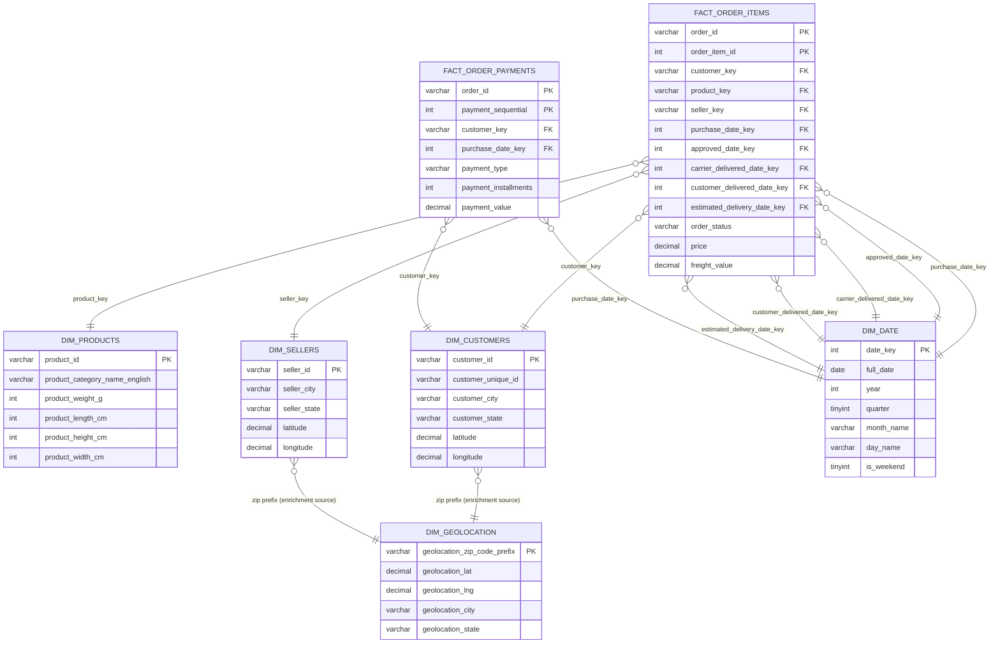

# Data Model

## Source

Olist Brazilian E-Commerce Public Dataset — nine CSVs covering orders, order
items, payments, products, customers, sellers, geolocation, category name
translation, and reviews. Eight of the nine were staged and fully
modeled; reviews was left out of this phase.

## Layers

```
CSV files  →  staging tables (stg_*)  →  dimensions (dim_*)  →  fact (fact_order_items)
```

The staging layer holds every column as `VARCHAR`, no exceptions. The raw
files have blank strings where numbers are expected and dates in a
non-ISO string format (`%d-%m-%y %H:%i`), and both break silently on
implicit cast during `LOAD DATA`. Typing is deferred to the dimension and
fact build step, where `NULLIF` and `STR_TO_DATE` get a chance to clean
the value before it's cast.

## Grain

**fact_order_items** — one row per order item. An order with three line
items produces three fact rows, each with its own `price` and
`freight_value`. This is the lowest grain the source data supports for
the order/item/product/seller relationship.

## Schema



## Design decisions worth flagging

**Role-playing date dimension.** `dim_date` is built once and referenced
five separate times from the fact table — purchase, approval, carrier
handoff, customer delivery, estimated delivery — through five differently
named foreign keys. One physical table, five logical roles. This keeps
the fact table capable of answering delivery-performance questions
(actual vs. estimated, purchase-to-approval lag, etc.) without needing a
join per lifecycle stage against a duplicated table.

**Geolocation folded into customer/seller, not left as a third fact-table
join.** `dim_geolocation` exists as its own table, deduplicated to one row
per zip prefix, but its lat/lng are also pushed directly into
`dim_customers` and `dim_sellers` at build time. The fact table never
joins to geolocation directly. Reasoning: coordinates are only ever
consumed at the customer or seller level in this model — no query needs
geolocation at order-item grain — so paying for an extra join on every
fact query would buy nothing. This is a deliberate denormalization, not
an oversight.

**Order status kept as a degenerate attribute on the fact.** `order_status`
has low cardinality and belongs to the order, not the item, but splitting
it into its own dimension table for eight-ish possible values would add a
join for no analytical gain. It stays on the fact row as a degenerate
dimension.

**Natural keys, not surrogate integers.** Every dimension uses the source
system's natural key (`product_id`, `customer_id`, `seller_id`) as its
primary key rather than generating an auto-increment surrogate. This
keeps the model simpler to build and reason about, at the cost of wider
indexes and joins than integer surrogate keys would give — a fair
trade-off at this data volume, worth revisiting if the dataset were
sitting on a system where join performance at scale actually mattered.

**Payments modeled as a second, separate fact table.** `fact_order_payments`
exists at its own grain — one row per order per `payment_sequential` —
rather than being merged into `fact_order_items`. The reason is grain
mismatch: an order can have multiple payment rows (installments, or more
than one payment method on the same order), so payments don't collapse
cleanly onto the order-item grain. Forcing it in would have meant either
duplicating price/freight across payment rows or duplicating payment
values across item rows — both wrong. This is a fact constellation, not
a single star: two fact tables sharing `dim_customers` and `dim_date` as
conformed dimensions, each at the grain its own source data actually
supports. A cross-check query in `08_fact_order_payments.sql` sums
`fact_order_payments` per order and compares it against
`price + freight_value` summed per order in `fact_order_items`, to
confirm the two facts stay consistent with each other despite living at
different grains.

**Reviews excluded from this phase.** Not modeled, not staged. Scope for
this build was the transactional core — orders, items, products,
customers, sellers, geography, time.
